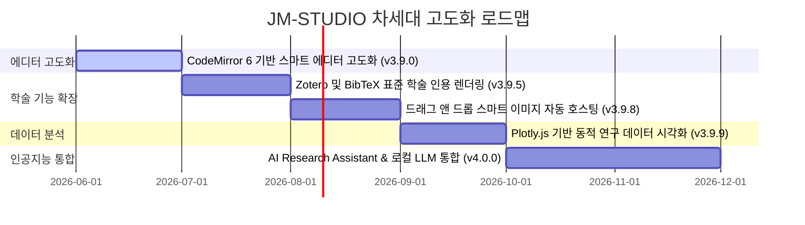

# 🚀 Joy Markdown Studio (JM-STUDIO) Updates Roadmap

> **Ultimate Science & Engineering Research and Academic Markdown Editing & Visualization Studio**  
> 본 로드맵은 v3.8.1 성공적인 릴리즈 이후, JM-STUDIO를 세계 최고 수준의 이공계 학술 연구용 마크다운 스튜디오로 도약시키기 위한 공식 제품 로드맵 및 기술 업데이트 계획서입니다.

---

## 📌 제품 지향점 (Product Identity)
JM-STUDIO는 단순한 범용 지식 기록 장치(Zettelkasten)인 Obsidian 등과 차별화되며, **"이공계 학술 연구자가 아무런 사전 설정 없이 즉시 논문을 쓰고, 공식을 설계하며, 분자식을 시각화하고, 데이터를 동적 차트화하는 풀옵션 장착 프리미엄 학술 스튜디오"**를 완벽히 지향합니다.

---

## 🗺️ 기술 업데이트 로드맵 요약 (Overview)



---

## 🛠️ 세부 마일스톤 및 기술 스펙 (Milestones)

### 💎 Phase 1: 에디터 코어 고도화 (v3.9.0 목표)
기존의 단순 HTML `<textarea>` 구조를 극복하고 전문적인 마크다운 타이핑을 실현합니다.

> [!TIP]
> **CodeMirror 6 도입**
> - **목적**: 코딩 편집 및 마크다운 수식 작성 시 에디터 자체 시인성 극대화.
> - **주요 기능**:
>   - 에디터 내 마크다운 문법 실시간 하이라이팅.
>   - 괄호 짝 맞추기, 들여쓰기 자동 정렬, 멀티 커서 및 미니맵 제공.
>   - 수식(`$...$`), 화학식(````smiles ````)에 대한 내부 하이라이팅 확장팩 개발.

---

### 🎓 Phase 2: 학술 인용 및 자산 관리 자동화 (v3.9.5 ~ v3.9.8 목표)
논문 저술에 완벽하게 정합할 수 있도록 참고문헌과 학술용 자산을 똑똑하게 관리합니다.

> [!IMPORTANT]
> **Zotero & BibTeX 표준 학술 인용 렌더링**
> - 서재 폴더 내 `references.bib` 파일을 자동 스캔 및 인덱싱.
>   - 에디터 상에서 `[@citation_key]` 입력 시 스마트 자동완성 팝업 가동.
>   - Standalone HTML 익스포트 및 A4 PDF 인쇄 시 **하단에 IEEE/APA 스타일 참고문헌 리스트 자동 생성 및 포맷팅**.

> [!NOTE]
> **드래그 앤 드롭 스마트 이미지 자동 호스팅**
> - 이미지 파일을 에디터에 드롭하거나 스크린샷 붙여넣기(`Ctrl+V`) 시:
>   - 현재 워크스페이스 하위의 `assets/images/` 폴더에 타임스탬프 기반 파일로 자동 변환 저장.
>   - 마크다운 이미지 링크(``) 자동 주입.

---

### 📊 Phase 3: Plotly.js 기반 동적 데이터 시각화 (v3.9.9 목표)
데이터 테이블 및 플로팅 수치를 캡처본이 아닌 살아 움직이는 인터랙티브 차트로 즉시 감상합니다.

> [!WARNING]
> **Plotly.js & Chart.js 엔진 연동**
> - 마크다운 내 데이터 테이블 혹은 ````chart ```` 코드 블록 작성 시 실시간 그래픽 렌더링.
>   - **분포도(Scatter Plot), 선 차트(Line Chart), 3D 벡터 흐름도** 지원.
>   - 줌 인/아웃, 개별 데이터 포인트 오버레이 및 이미지로 저장 기능 탑재.

---

### 🤖 Phase 4: AI Research Assistant (v4.0.0 메이저 릴리즈 목표)
수동 작성의 장벽을 뛰어넘어, 학술 AI 비서가 내 수식과 화학 구조를 정교화해줍니다.

> [!CAUTION]
> **로컬 LLM (Ollama) 및 Cloud OpenAI API 연동**
> - **AI 연구 어시스턴트 패널**: 우측 TOC 슬라이딩 영역에 별도 탭으로 탑재.
> - **핵심 AI 지원 기능**:
>   - "이 수식을 슈뢰딩거 3차원 정상파 방정식으로 다듬어줘" -> KaTeX 자동 렌더링 검수.
>   - "아스피린과 구조가 비슷한 물질의 SMILES 코드를 알려줘" -> SMILES 블록 원클릭 빌드.
>   - "내가 열어둔 서재 문서들 기반으로 지식 그래프 상에서 밀접한 아이디어 요약해줘".

---

## 📈 장기 로드맵 검토 과제 (Backlog Items)
1. **Typora식 위지윅(WYSIWYG) 하이브리드 실시간 편집 모드**: 프리뷰와 에디터를 단일 통합 뷰로 제공.
2. **실시간 클라우드 동시 편집(Co-editing) 기술**: 여러 명이 하나의 서재에서 협업하는 기능.
3. **학술 논문 커스텀 템플릿 제공**: Nature, IEEE, Springer 포맷에 맞춘 문서 레이아웃 원클릭 출력 엔진.

---
<ctrl94>up_to_date}
*본 로드맵은 JM-STUDIO의 공식 개발 가이드라인으로 활용되며, 마일스톤에 맞게 투명하고 체계적으로 진행될 예정입니다.* 🚀
